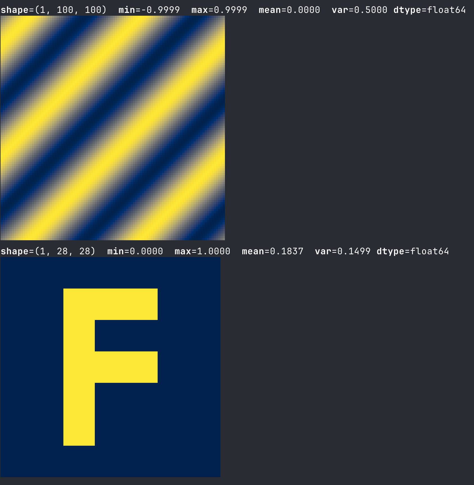
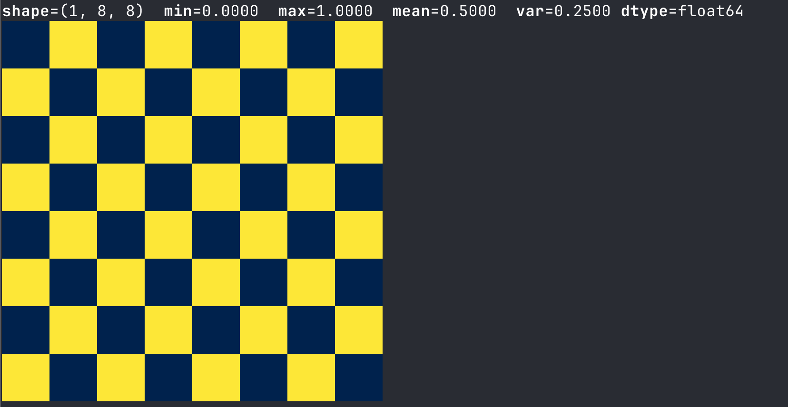
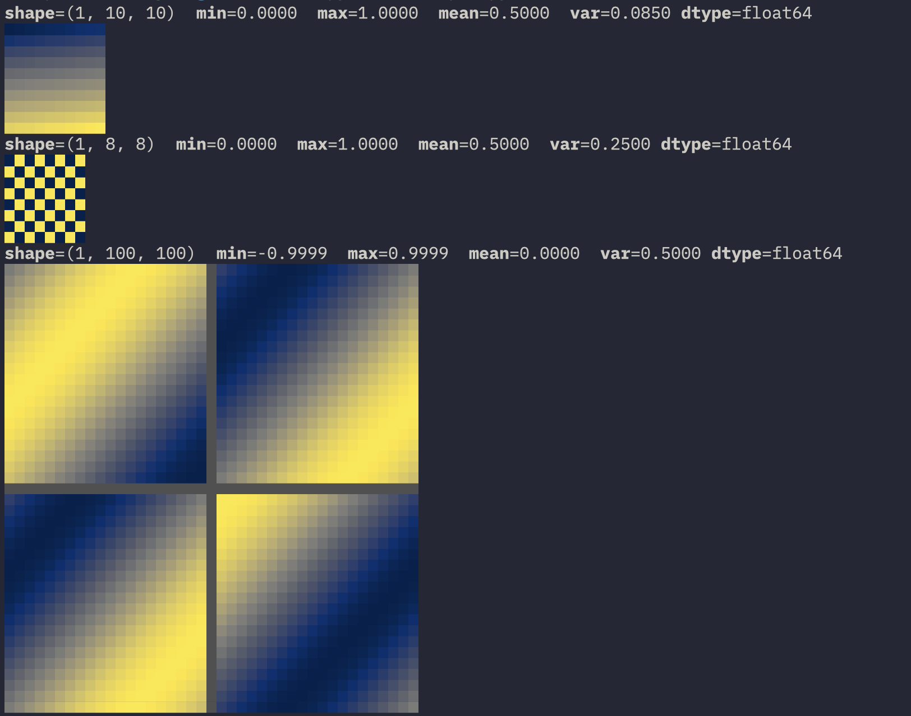

# numpix

An almost dependency free (as far as I'm concerned, numpy is part of the stdlib of Python haha) array visualizer for the terminal. Inspect numpy, PyTorch, and JAX arrays as colored pixel grids — right in your shell. Think `treescope` but without the jupyter part.


## Features

- **Works with numpy, PyTorch, and JAX** — pass any array-like, no conversion needed
- **1D, 2D, and 3D arrays** — 1D arrays render as a row, 3D arrays render slices side-by-side
- **Kitty graphics protocol** — crisp, high-resolution rendering in [Kitty](https://sw.kovidgoyal.net/kitty/), [Ghostty](https://ghostty.org/), and WezTerm; graceful Unicode fallback everywhere else
- **Stats header** — shape, min, max, mean, and variance printed above every visualization
- **Multiple colormaps** — `cividis`, `magma`, `inferno`, `plasma`, `hot`, `coolwarm`, `grey`
- **Large array truncation** — big arrays are intelligently truncated with a grey separator so you always see both ends
- **Zero dependencies** — pure Python stdlib + numpy only

## Examples




Fallback for terminals that don't support the kitty protocol:



## Installation

```bash
pip install numpix
```

## Usage

```python
from numpix import pix
import numpy as np

# 2D array
pix(np.random.rand(28, 28))

# 1D array — rendered as a single row
pix(np.sin(np.linspace(0, 2 * np.pi, 100)))

# 3D array — slices shown side by side
batch = np.stack([
    np.random.rand(28, 28),
    np.eye(28),
    np.outer(np.sin(np.linspace(0, np.pi, 28)), np.ones(28)),
])
pix(batch)
```

Works with PyTorch and JAX tensors too — no `.numpy()` needed:

```python
import torch, jax.numpy as jnp

pix(torch.randn(3, 28, 28))
pix(jnp.array(batch))
```

## API

```python
numpix.pix(
    array,
    max_show: int = 40,
    color_scheme: str = "cividis",
    max_slices: int = 3,
    layout: Literal["horizontal", "vertical"] = "horizontal",
    use_kitty_protocol: bool = True,
)
```

| Parameter | Description |
|---|---|
| `array` | numpy ndarray, PyTorch tensor, or JAX array. Up to 3 dimensions. |
| `max_show` | Max rows/cols shown before truncating (Unicode fallback mode). Default `20`. |
| `color_scheme` | One of `cividis`, `magma`, `inferno`, `plasma`, `hot`, `coolwarm`, `grey`. Default `cividis`. |
| `max_slices` | Max number of 2D slices shown for 3D arrays. Default `4`. |
| `layout` | Arrange slices `"horizontal"` (side by side) or `"vertical"` (stacked). Default `"horizontal"`. |
| `use_kitty_protocol` | Use the Kitty graphics protocol if supported. Default `True`. |

## Terminal support

| Terminal | Rendering |
|---|---|
| Kitty | High-resolution pixel graphics |
| Ghostty | High-resolution pixel graphics |
| WezTerm | High-resolution pixel graphics |
| Everything else | Unicode half-block characters (`▄▀`) |

numpix auto-detects support at import time — no configuration required.

## License

MIT
